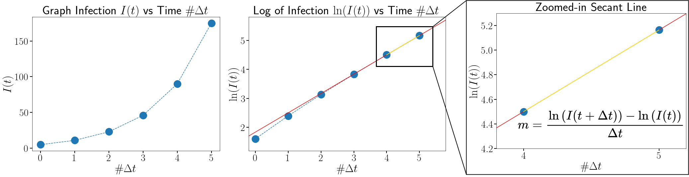

# Dominant Eigenvalue-Eigenvector Pair Estimation via Graph Infection

We present a novel method to estimate the dominant eigenvalue and eigenvector pair of any non-negative real matrix via graph infection.

The algorithm only requires a few lines of code:

```python
#!/usr/bin/env python3

for i in range(num_steps):
    x_new = x_old + A @ x_old * Delta_t
    I_new = np.sum(x_new)

    m = (math.log(I_new) - math.log(I_old)) / Delta_t
    dominant_eigenval = (math.exp(m * Delta_t) - 1) / Delta_t

    x_old = x_new
    I_old = I_new

# DONE
```

## Set up and Run

```python
pip install numpy networkx
python3 graph_infection_method.py
```

## Publication

Please see our arvix paper for more details: 
[Arvix https://arxiv.org/abs/2208.00982](https://arxiv.org/abs/2208.00982)



### Citation

```latex
@article{yangxia2022dominant,
  title={Dominant Eigenvalue-Eigenvector Pair Estimation via Graph Infection},
  author={Yang, Kaiyuan and Xia, Li and Tay, YC},
  journal={arXiv preprint arXiv:2208.00982},
  year={2022}
}
```
